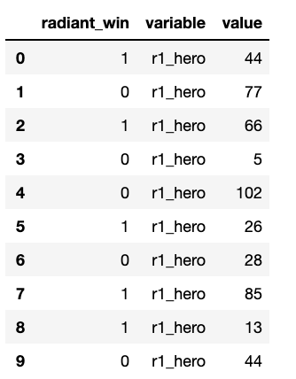
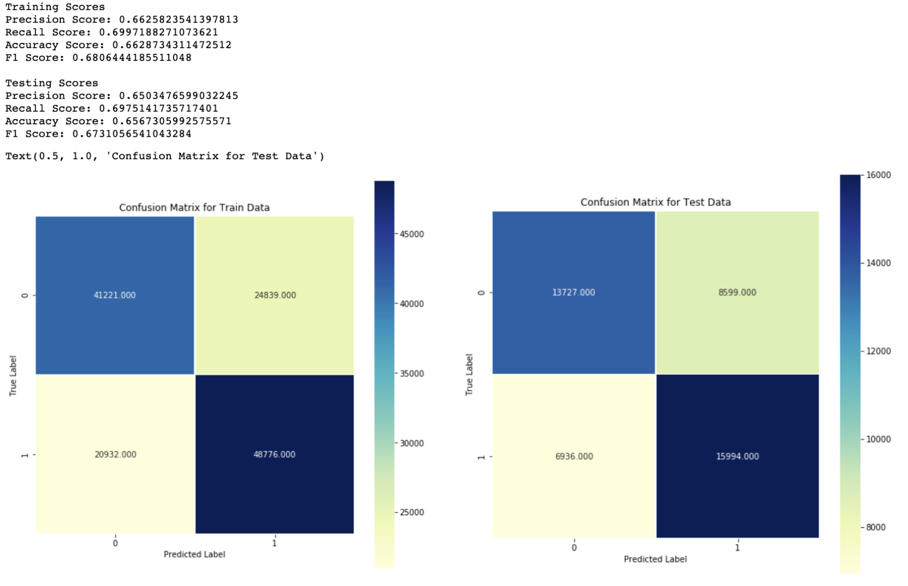
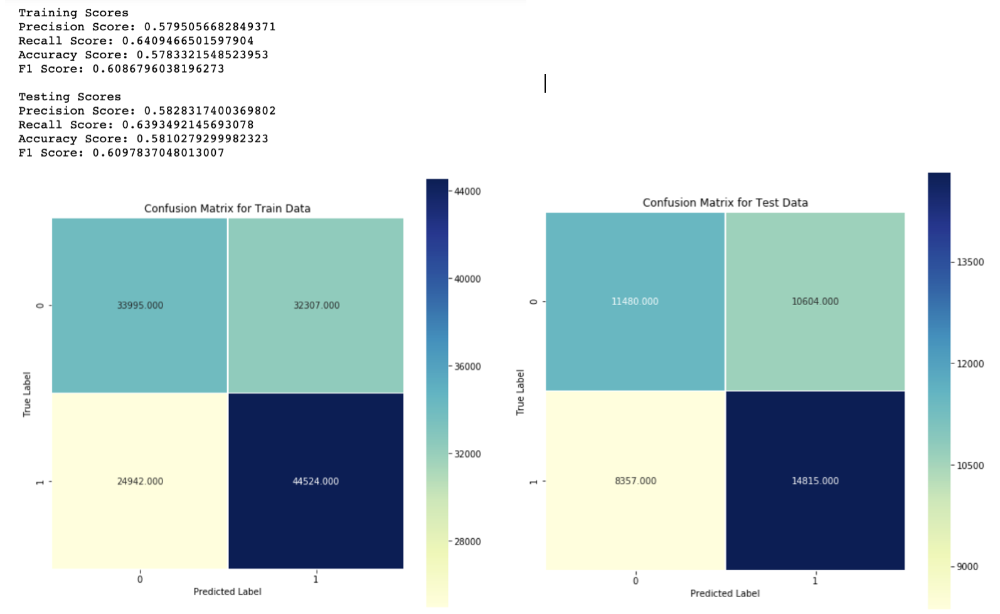

# Using Machine Learning to Predict Which Dota 2 Team Will Win

# Project Overview

For this project, I entered a Kaggle competition which provided a dataset containing over 181 thousand matches to train my classification models in order to predict whether the 'Radiant Team' will win. However, the kicker was that only data from the first 5 minutes was provided. This makes it very difficult to accurately predict the winner because games typically last anywhere from 20 to 50 minutes. So the data only provides a very brief snapshot.

Dota 2 is a MOBA (Multiplayer Online Battle Arena) in which 2 teams of 5 players face off until one team destroys the other's base. Based on this, to predict the winner required a classification problem as there are only 2 outcomes, win or loss.

<u><b> Baseline Model and Initial EDA </b></u>

Just looking at the dataset, I used my intuition to create new features to help make it more apparent to the model the relationship of certain columns with one another. I created new features to congregate the team scores and comparing them and then removing the original features in order to ensure a simple model.

My dataset when I prepared my first set of models contained 45 features and the following correlation plot:

  

While it is hard to see from this image what the features are, the important takeaway is that the majority of the features don't correlate with one another besides the features I believe would be the strongest predictors of the outcome of the game, which include which team got the first kill and the new features I engineered.

Another thing to look for before I started modeling was to check for class imbalance in my data set as that would alter my strategy for modeling.

  

Fortunately, my dataset did not have much imbalance and so I created a KNN classifier, Logistic Regression, Decision Trees, and Random Forests. Unfortunately, my tree based models and KNN classifier had a terrible time predicting the outcomes.

  

  

  

  

<u><b> Feature Engineering and Model Improvements </b></u>

Based on the results above, I knew I had to do a lot of feature engineering to pull out the relationship between my features in order to better explain the outcome. I had a feeling that my models were reading my columns containing the hero unique id (which character the players picked) as a continuous variable rather than a categorical and so I turned that column into dummy variables. 

Having experience playing MOBAs, I know that not all heros are created equally and the character each player picks has their own % chance of winning. Since I could not extract external data for this competition, I used the massive amount of data I already had for these 181 thousand matches and calculated each hero's chance of winning.

  

  

The tricky part was that the champions were distributed in 10 different columns and so I had to stack them into one column, since the same hero could appear in different columns (depends on which player picked the hero). I used the melt command in pandas to achieve this and then I was able to calculate the number of appearances by each unique hero and whether they won or not.

I also expanded on what I did initially, and converted every column that had descriptions of what the 2 teams did and converted them to be in comparison to one another rather than 2 independent features.

After doing all this feature engineering, I reran my models to check for improvements. KNN and the tree based models did improve a bit with random forest doing a lot better than it did initially. However, my 2 best models by far were logistic regression and XGBoost which I ran based on Logistic Regression.

  

  

<u><b> Model Optimizations and Conclusion </b></u>

I used gridsearch to optimize the parameters around my logistic regression model to see how hyper parameter tuning would improve my model. I also took a look at the best parameters for my models and it was all of the ones I engineered.

  

  

This brought the realization that feature engineering is the most important part of machine learning. If you have features that easily predict the problem, then that is great. However, if you are given limited data points and they don't do a great job explaining the problem by themselves, it really takes a strong understanding of the problem and your features and how they relate with each other in order to fully utilize what you have to make a good model. 

Feature engineering is an artform and should be heavily prioritized in all projects using machine learning.

